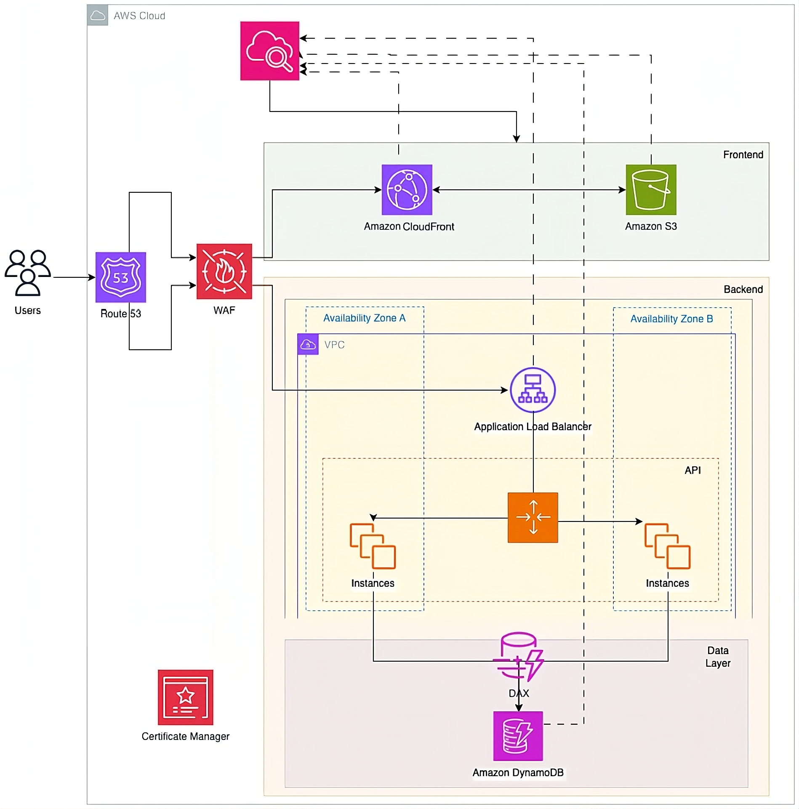

# 🍽️ AWS Recipe Sharing Platform 

[](https://aws.amazon.com/)
[](https://reactjs.org/)
[](https://fastapi.tiangolo.com/)
[](https://www.docker.com/)
[](https://www.typescriptlang.org/)

## 🙏 Acknowledgments

Special thanks to **[Manar](https://github.com/manarabdelmonem)** 👨‍🎓 for providing this amazing opportunity to learn and implement AWS solutions through the SAA learning path. 

Huge appreciation to **[Ayman Ali](https://github.com/aymanalimalik)** 🚀 - an incredible instructor whose guidance made this AWS journey both educational and enjoyable!

---

## 📖 Project Overview

A comprehensive **cloud-native recipe sharing platform** built with modern web technologies and deployed on AWS infrastructure. This project demonstrates real-world application of AWS services including serverless computing, content delivery, database management, and infrastructure as code.

### 🎯 Learning Objectives
- Master AWS core services and their practical applications 🎓
- Implement Infrastructure as Code using CloudFormation ⚙️
- Build scalable three-tier architecture on AWS 🏗️
- Practice CI/CD deployment strategies 🚀
- Understand AWS security best practices 🔐

---

## 📁 Project Structure

```
aws-recipe-sharing-app/
├── 📁 backend/                    # FastAPI Backend Services
│   ├── main.py                   # Core application logic & API endpoints
│   ├── requirements.txt          # Python dependencies
│   └── .env                      # Environment variables (local)
├── 📁 frontend/                   # React Frontend Application
│   ├── 📁 src/                   # Source code directory
│   │   ├── App.tsx              # Main React component
│   │   ├── App.css              # Application styles
│   │   ├── api.ts               # API service layer
│   │   ├── 📁 components/       # Reusable UI components
│   │   │   ├── RecipeCard.tsx   # Recipe display component
│   │   │   └── RecipeModal.tsx  # Recipe detail modal
│   │   ├── 📁 pages/            # Application pages
│   │   │   ├── HomePage/        # Main landing page
│   │   │   ├── AdminPage/       # Admin dashboard
│   │   │   └── UsersPage/       # User management
│   │   ├── 📁 types/            # TypeScript type definitions
│   │   ├── 📁 utils/            # Utility functions
│   │   └── 📁 assets/           # Static assets (images, icons)
│   │       ├── 📁 images/       # Application images
│   │       └── 📁 icons/        # SVG icons
│   ├── package.json             # Node.js dependencies
│   ├── tsconfig.json            # TypeScript configuration
│   └── vite.config.ts           # Vite build configuration
├── 📁 platform/                  # Infrastructure as Code
│   └── cloudformation.yaml     # AWS CloudFormation template (639 lines)
├── 📁 terraform/                 # Alternative IaC with Terraform
│   ├── main.tf                  # Terraform configuration
│   ├── terraform.tfvars.example # Example variables
│   └── user-data.sh             # EC2 initialization script
├── 📁 images/                    # Documentation assets
│   └── aws_architecture.png    # Architecture diagram
├── docker-compose.yml           # Local development environment
├── Dockerfile                   # Container configuration
├── requirements.txt             # Root Python dependencies
└── README.md                    # Project documentation
```

---

## 🏗️ AWS Architecture Overview



The application follows a **three-tier architecture** pattern with high availability and scalability:

### 🌐 **Presentation Tier (Frontend)**
- **S3 Static Website Hosting** 📦 - Hosts React.js single-page application
- **CloudFront CDN** 🌍 - Global content delivery with edge caching
- **Route 53 DNS** 🔗 - Domain name resolution and traffic routing

### ⚡ **Application Tier (Backend)**
- **Application Load Balancer** ⚖️ - Distributes traffic across multiple instances
- **EC2 Auto Scaling Group** 📈 - Automatic scaling based on demand
- **VPC with Public/Private Subnets** 🔐 - Secure network isolation
- **NAT Gateway** 🌐 - Secure outbound internet access for private subnets

### 🗄️ **Data Tier (Database)**
- **DynamoDB** 📊 - NoSQL database with global secondary indexes
- **Point-in-Time Recovery** 🔄 - Automated backup and restore capabilities
- **IAM Roles & Policies** 🛡️ - Least privilege access control

---

## 🛠️ Technology Stack

### **🎨 Frontend Technologies**
| Technology | Purpose | Benefits |
|------------|---------|----------|
| **React.js 18** | UI Library | Modern hooks, component-based architecture |
| **TypeScript** | Type Safety | Compile-time error checking, better IDE support |
| **Vite** | Build Tool | Fast HMR, optimized bundling, modern ES modules |
| **CSS3 + Glassmorphism** | Styling | Modern visual effects, responsive design |

### **⚙️ Backend Technologies**
| Technology | Purpose | Benefits |
|------------|---------|----------|
| **FastAPI** | Web Framework | High performance, automatic API docs, async support |
| **Pydantic** | Data Validation | Type validation, serialization, settings management |
| **Uvicorn** | ASGI Server | Production-ready, async request handling |
| **Python 3.10+** | Runtime | Modern syntax, performance improvements |

### **☁️ AWS Cloud Services**
| Service | Tier | Purpose | Configuration |
|---------|------|---------|-------------|
| **S3** | Presentation | Static hosting | Public read access, website configuration |
| **CloudFront** | Presentation | CDN | HTTPS redirect, custom error pages |
| **EC2** | Application | Compute | t3.micro instances, user data scripts |
| **ALB** | Application | Load balancing | Health checks, target groups |
| **Auto Scaling** | Application | Scaling | CPU-based policies, min/max instances |
| **DynamoDB** | Data | Database | On-demand billing, GSI for queries |
| **VPC** | Network | Isolation | CIDR 10.0.0.0/16, multi-AZ subnets |
| **IAM** | Security | Access control | Least privilege roles and policies |

### **🔧 DevOps & Development Tools**
| Tool | Purpose | Configuration |
|------|---------|-------------|
| **Docker** | Containerization | Multi-stage builds, optimized images |
| **Docker Compose** | Local Development | Service orchestration, volume mapping |
| **CloudFormation** | Infrastructure as Code | 639-line template, parameterized |
| **AWS CLI** | Cloud Management | Programmatic AWS access |

---

## ☁️ CloudFormation Infrastructure Deep Dive

The **639-line CloudFormation template** (`platform/cloudformation.yaml`) implements a complete production-ready infrastructure following AWS Well-Architected Framework principles:

### 📋 **Template Parameters**
```yaml
Parameters:
  EnvironmentName: String        # Environment identifier (dev/staging/prod)
  DomainName: String            # Custom domain for the application
  CertificateArn: String        # SSL certificate for HTTPS
  KeyPairName: String           # EC2 key pair for SSH access
```

### 🌐 **Networking Layer**
#### **VPC Configuration**
- **CIDR Block**: 10.0.0.0/16 (65,536 IP addresses)
- **Multi-AZ Deployment**: Spans 2 Availability Zones for high availability
- **DNS Support**: Enabled for hostname resolution

#### **Subnet Architecture**
```
├── Public Subnets (10.0.1.0/24, 10.0.2.0/24)
│   ├── ALB instances
│   ├── NAT Gateway
│   └── Internet Gateway access
└── Private Subnets (10.0.3.0/24, 10.0.4.0/24)
    ├── EC2 application instances
    ├── Auto Scaling Group
    └── Outbound traffic via NAT Gateway
```

#### **Gateway & Routing**
- **Internet Gateway**: Provides internet access to public subnets
- **NAT Gateway**: Enables secure outbound internet access for private instances
- **Route Tables**: Custom routing for public/private subnet traffic

### �️ **Security Groups**
#### **ALB Security Group**
```yaml
SecurityGroupIngress:
  - IpProtocol: tcp
    FromPort: 80
    ToPort: 80
    CidrIp: 0.0.0.0/0      # HTTP traffic from anywhere
  - IpProtocol: tcp
    FromPort: 443
    ToPort: 443
    CidrIp: 0.0.0.0/0      # HTTPS traffic from anywhere
```

#### **EC2 Security Group**
```yaml
SecurityGroupIngress:
  - IpProtocol: tcp
    FromPort: 8000
    ToPort: 8000
    SourceSecurityGroupId: !Ref ALBSecurityGroup  # Only ALB traffic
  - IpProtocol: tcp
    FromPort: 22
    ToPort: 22
    CidrIp: 0.0.0.0/0      # SSH access (configure as needed)
```

### �🚀 **Compute Layer**
#### **Launch Template**
```yaml
LaunchTemplate:
  ImageId: ami-0c02fb55956c7d316    # Amazon Linux 2023
  InstanceType: t3.micro            # Cost-optimized for demo
  SecurityGroupIds: [!Ref EC2SecurityGroup]
  IamInstanceProfile: !Ref EC2InstanceProfile
  UserData: !Base64
    Fn::Sub: |
      #!/bin/bash
      yum update -y
      yum install -y python3 python3-pip git
      # Application deployment script
```

#### **Auto Scaling Group**
- **Min Size**: 2 instances (high availability)
- **Max Size**: 6 instances (handles traffic spikes)
- **Desired Capacity**: 2 instances (normal operation)
- **Health Check Type**: ELB (application-aware)
- **Health Check Grace Period**: 300 seconds

#### **Scaling Policies**
```yaml
ScaleUpPolicy:
  AdjustmentType: ChangeInCapacity
  ScalingAdjustment: 1
  Cooldown: 300

ScaleDownPolicy:
  AdjustmentType: ChangeInCapacity
  ScalingAdjustment: -1
  Cooldown: 300
```

### ⚖️ **Load Balancing**
#### **Application Load Balancer**
```yaml
Scheme: internet-facing
Subnets: [PublicSubnet1, PublicSubnet2]
SecurityGroups: [ALBSecurityGroup]
LoadBalancerAttributes:
  - Key: idle_timeout.timeout_seconds
    Value: '60'
```

#### **Target Group Configuration**
```yaml
HealthCheckPath: /health
HealthCheckProtocol: HTTP
HealthCheckIntervalSeconds: 30
HealthyThresholdCount: 2
UnhealthyThresholdCount: 5
```

#### **HTTPS Redirect**
```yaml
ListenerRule:
  Actions:
    - Type: redirect
      RedirectConfig:
        Protocol: HTTPS
        StatusCode: HTTP_301
```

### 🗄️ **Database Layer**
#### **DynamoDB Table**
```yaml
TableName: !Sub ${EnvironmentName}-RecipesTable
BillingMode: ON_DEMAND              # Pay-per-request pricing
PointInTimeRecoveryEnabled: true    # Backup and restore
```

#### **Global Secondary Index**
```yaml
GlobalSecondaryIndexes:
  - IndexName: CategoryIndex
    KeySchema:
      - AttributeName: category
        KeyType: HASH
    Projection:
      ProjectionType: ALL
```

### 🔐 **IAM Security**
#### **EC2 Instance Role**
```yaml
AssumeRolePolicyDocument:
  Statement:
    - Effect: Allow
      Principal:
        Service: ec2.amazonaws.com
      Action: sts:AssumeRole

Policies:
  - PolicyName: DynamoDBAccess
    PolicyDocument:
      Statement:
        - Effect: Allow
          Action:
            - dynamodb:GetItem
            - dynamodb:PutItem
            - dynamodb:Query
            - dynamodb:Scan
            - dynamodb:UpdateItem
            - dynamodb:DeleteItem
          Resource: !GetAtt RecipesTable.Arn
```

### 📊 **Monitoring & Alarms**
#### **CloudWatch Alarms**
```yaml
HighCPUAlarm:
  MetricName: CPUUtilization
  ComparisonOperator: GreaterThanThreshold
  Threshold: 70
  EvaluationPeriods: 2
  AlarmActions: [!Ref ScaleUpPolicy]

LowCPUAlarm:
  MetricName: CPUUtilization
  ComparisonOperator: LessThanThreshold
  Threshold: 25
  EvaluationPeriods: 2
  AlarmActions: [!Ref ScaleDownPolicy]
```

### 📤 **Outputs for Integration**
```yaml
Outputs:
  VPCId:
    Description: VPC ID for cross-stack references
    Value: !Ref VPC
    Export:
      Name: !Sub ${EnvironmentName}-VPCID
  
  ApplicationLoadBalancer:
    Description: ALB DNS name
    Value: !GetAtt ApplicationLoadBalancer.DNSName
  
  DynamoDBTable:
    Description: DynamoDB table name
    Value: !Ref RecipesTable
```

---

## 🚀 Key Features

- ✨ **Recipe Management**: Create, read, and delete recipes with ease
- 🎯 **Role-based Access**: Separate admin and user interfaces  
- 📱 **Responsive Design**: Works seamlessly on desktop, tablet, and mobile
- ⚡ **High Performance**: DynamoDB provides fast data access
- 🌍 **Global Reach**: CloudFront ensures fast loading worldwide
- 🔐 **Secure**: HTTPS encryption and AWS security best practices
- 📈 **Auto-Scaling**: Automatic capacity management based on demand
- 🏗️ **Infrastructure as Code**: Complete CloudFormation template for reproducible deployments

---

## 🐳 Docker Usage

The application includes Docker configuration for easy local development and deployment:

```bash
# Build and run the application
docker-compose up --build

# Run in detached mode
docker-compose up -d

# Stop the application
docker-compose down

# View logs
docker-compose logs -f backend
docker-compose logs -f frontend
```

### Docker Architecture
```yaml
# docker-compose.yml structure
services:
  frontend:
    build: ./frontend
    ports: ["3000:80"]
    depends_on: [backend]
    
  backend:
    build: ./backend
    ports: ["8000:8000"]
    environment:
      - AWS_REGION=us-east-1
      - DYNAMODB_TABLE=RecipesTable
```

The Docker setup includes:
- **Frontend**: Nginx server serving the React build 🌐
- **Backend**: Python FastAPI application 🐍
- **Environment**: Configured for development and production 🛠️
- **Volume Mounting**: For hot reloading during development 🔄

---

## 🌟 Why This Architecture?

This architecture demonstrates several AWS best practices and learning outcomes:

### **🏗️ Scalability**
- **Auto Scaling Groups**: Automatically add/remove instances based on demand
- **Application Load Balancer**: Distributes traffic evenly across healthy instances
- **DynamoDB On-Demand**: Scales read/write capacity automatically
- **CloudFront CDN**: Reduces origin load and improves global performance

### **🛡️ Security**
- **VPC Isolation**: Private subnets protect application instances
- **Security Groups**: Act as virtual firewalls with least privilege rules
- **IAM Roles**: Eliminate hardcoded credentials and follow least privilege
- **HTTPS Everywhere**: SSL/TLS encryption for all communications

### **⚡ Performance**
- **Multi-AZ Deployment**: Reduces latency and improves availability
- **CloudFront Edge Locations**: Cache content closer to users
- **DynamoDB Single-Digit Latency**: Fast database operations
- **Application Load Balancer**: Health checks ensure traffic goes to healthy instances

### **💰 Cost Optimization**
- **On-Demand Pricing**: Pay only for what you use
- **Auto Scaling**: Automatically reduces instances during low traffic
- **S3 Static Hosting**: Cost-effective frontend hosting
- **t3.micro Instances**: Burstable performance for variable workloads

### **🔄 Reliability**
- **Multi-AZ Architecture**: Survives single AZ failures
- **Auto Scaling Health Checks**: Automatically replace unhealthy instances
- **DynamoDB Point-in-Time Recovery**: Protect against data loss
- **Load Balancer Health Checks**: Route traffic only to healthy instances

---

## 🚀 Deployment Guide

### **Prerequisites**
- AWS CLI configured with appropriate permissions 🔑
- AWS account with necessary service limits 📊
- Domain name and SSL certificate (optional) 🌐

### **CloudFormation Deployment**
```bash
# Deploy the infrastructure
aws cloudformation create-stack \
  --stack-name recipe-sharing-app \
  --template-body file://platform/cloudformation.yaml \
  --parameters \
    ParameterKey=EnvironmentName,ParameterValue=production \
    ParameterKey=KeyPairName,ParameterValue=your-key-pair \
  --capabilities CAPABILITY_IAM

# Monitor deployment progress
aws cloudformation describe-stacks \
  --stack-name recipe-sharing-app \
  --query 'Stacks[0].StackStatus'

# Get stack outputs
aws cloudformation describe-stacks \
  --stack-name recipe-sharing-app \
  --query 'Stacks[0].Outputs'
```

### **Local Development**
```bash
# Clone the repository
git clone <repository-url>
cd aws-recipe-sharing-app

# Set up backend
cd backend
python -m venv venv
source venv/bin/activate  # On Windows: venv\Scripts\activate
pip install -r requirements.txt

# Set up frontend
cd ../frontend
npm install
npm run dev

# Or use Docker Compose
docker-compose up --build
```
